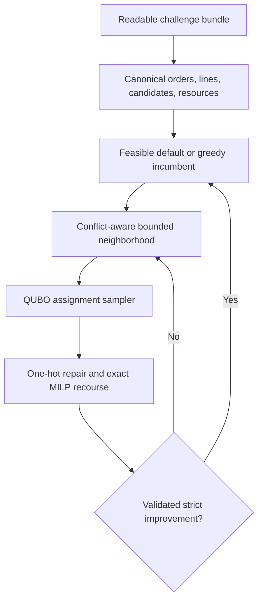

# WISER–Nestlé Distributed Order Management optimizer

This branch is the experiment-ready implementation for the 2026 WISER–Nestlé
Distributed Order Management (DOM) challenge. It reads the supplied proof-of-concept
data, constructs a validated optimization instance, compares transparent classical
baselines with an exact solver and a hybrid quantum-classical search, and persists
aggregate tables and figures. Final reports, planner PDFs, and slides are deliberately
deferred until the full experiment profile has produced reviewed results.

The central safety rule is simple: a QUBO sample is only a proposal. Exact
mixed-integer recourse rebuilds SKU quantities, an independent validator checks all
hard constraints, and a move is accepted only when it is feasible and improves the
current solution. A weak or noisy sampler can consume runtime, but it cannot worsen
the returned incumbent.

## What is implemented

- strict readability checks for the five runtime input CSVs;
- a cleanup command that removes numbered-upload names and retains only runtime
  inputs plus two optional recommendation outputs;
- a real-data adapter for orders, inventory, lanes, dock availability, and throughput
  observations;
- source-accurate case conversion and thresholded order-penalty logic;
- load-cohesive candidate generation, five-day protected ATP, shipping lead times,
  working-day PGI adjustment, forecast eligibility, and dock usage;
- deterministic load-atomic default and sequential-greedy baselines;
- an exact SciPy/HiGHS mixed-integer linear program (MILP);
- bounded large-neighborhood search with QUBO assignment proposals and exact MILP
  fulfillment recourse;
- exact enumeration, random sampling, simulated annealing, and optional D-Wave
  backends behind an explicit privacy gate;
- an independent objective evaluator and feasibility validator;
- all requested experiments, business- and QUBO-penalty sweeps, and additional
  controls;
- automatically saved tables and PNG figures under `runs/challenge-study/`;
- an opt-in synthetic CPU/GPU crossover benchmark and privacy-gated D-Wave test; and
- a runnable Jupyter notebook and aggregate-only Streamlit planner copilot.

No QPU experiment has been run and no quantum advantage is claimed.

## Verified supplied-data audit

The repository intentionally publishes only non-identifying aggregates.

| Measure | Verified value |
|---|---:|
| Required runtime CSVs opened | 5 of 5 |
| Order-level output rows | 1,109 |
| Order-SKU output rows | 25,193 |
| Named loads | 614 |
| Assignment groups after singleton handling | 631 |
| Diverted orders in supplied output | 3 |
| Requested cases | 2,554,440 |
| Selected fulfilled cases | 2,413,937 |
| Selected case fill | 94.4997% |

The input order table contains 25,193 order-SKU rows. The capacity-planning table
contains 377,504 DC-SKU-date rows, shipping contains 12,922 lanes, dock contains 480
rows, and throughput contains 530 observed-utilization rows. The optional output
files are used only for reconciliation; they are never treated as labels for
optimization. The challenge PDF, equations document, and worked workbook are source
references, not runtime solver inputs.

## Solver architecture



The exact model assigns each order to one eligible DC/PGI option or leaves it
unassigned. Partial fulfillment is allowed at the selected DC, but an order cannot
split across DCs. Orders sharing a source load move together. The objective is:

$$
\text{fulfilled value}-\text{thresholded unmet penalty}-\text{shipping cost}.
$$

Hard constraints cover demand balance, candidate eligibility, projected inventory,
dock capacity, optional scenario capacity, the diversion-uplift rule, pallet/case
accounting, and assignment-group cohesion. See the
[mathematical formulation](docs/mathematical_formulation.md) and
[source mapping](docs/poc_data_mapping.md).

## Installation

Python 3.10 or newer is required.

```bash
python -m venv .venv
source .venv/bin/activate
python -m pip install --upgrade pip
python -m pip install -e ".[dev,notebook,app]"
```

Optional extras are `.[gpu]` for CUDA 12 CuPy benchmarking, `.[qpu]` for D-Wave,
and `.[full]` for the complete workstation environment. The default solver remains
local and CPU-based because exact recourse and small local QUBOs dominate the current
workload.

## Prepare the challenge bundle

Keep raw files outside Git. Browser downloads commonly add suffixes such as `(1)`
and macOS archives add metadata sidecars. Create a clean directory with stable names:

```bash
python scripts/prepare_challenge_bundle.py \
  --source-dir /approved/path/to/downloads \
  --output-dir data/raw/nestle_challenge
```

The resulting directory contains five required inputs:

- `input_order_data.csv`
- `input_capacity_planning.csv`
- `input_shipping_cost_data.csv`
- `input_dock_capacity.csv`
- `input_throughput_capacity.csv`

When available, the script also retains `output_order_level_data.csv` and
`output_order_sku_level_data.csv` for optional reconciliation. It excludes the PDF,
DOCX, XLSX, screenshots, ZIP files, numbered duplicates, and AppleDouble metadata.

## Run the challenge study

Point the command to the cleaned directory:

```bash
python scripts/run_challenge_study.py \
  --bundle-dir /approved/path/to/challenge-files \
  --profile full \
  --output runs/challenge-study/aggregate_results.csv
```

The command first opens every required file and stops on the first missing,
unreadable, empty, or structurally invalid artifact. `--profile smoke` runs a short
development grid; `--profile full` runs the evidence grid. Aggregate CSVs and all
applicable PNG charts are written below `runs/challenge-study/`.

## Run the notebook

```bash
jupyter lab notebooks/nestle_challenge_experiments.ipynb
```

Set `NESTLE_BUNDLE_DIR` before launching Jupyter, or use the default cleaned path
`data/raw/nestle_challenge`. The notebook performs and checkpoints:

1. strict bundle and output reconciliation audits;
2. default, greedy, exact MILP, and hybrid comparison;
3. size scaling;
4. business penalty-weight sensitivity;
5. QUBO one-hot and conflict-penalty calibration;
6. candidate-count sensitivity;
7. inventory shocks;
8. sampler seed and local coefficient-noise sensitivity;
9. Pareto-pruning ablation;
10. random-versus-conflict batching ablation;
11. random-versus-simulated-annealing sampler ablation;
12. a synthetic coordination control with a known exact reference;
13. an optional CPU/GPU QUBO-scoring crossover; and
14. an optional synthetic-only D-Wave hardware validation.

All persisted experiment rows are aggregate-only.

## Run the planner copilot

The copilot is useful because the experiment matrix is multi-dimensional and planners
need explanations, not raw solver logs. It is deliberately rules-based: no external
language model receives the data, and identifier-bearing uploads are rejected.

```bash
python -m streamlit run apps/planner_copilot.py
```

It explains solver comparisons, scaling, sensitivities, ablations, and the limits of
the evidence. See [app instructions](apps/README.md).

## Reproduce the known-optimum test

```bash
python scripts/make_tiny_instance.py
python scripts/run_experiment.py \
  --data-dir data/synthetic/tiny \
  --methods default greedy classical hybrid \
  --hybrid-config configs/hybrid_tiny.yaml \
  --output-dir runs/tiny-comparison \
  --experiment-id tiny-comparison
pytest
```

The tiny instance has a proven optimum of 126 synthetic units. The exact MILP and
hybrid exact-QUBO configuration both reproduce it.

## Repository map

| Path | Purpose |
|---|---|
| `src/domopt/poc.py` | runtime-bundle cleanup, audit, and source adapter |
| `src/domopt/classical.py` | exact MILP and fixed-assignment recourse |
| `src/domopt/hybrid.py` | conflict batching, QUBO search, repair, and acceptance |
| `src/domopt/validation.py` | independent feasibility authority |
| `src/domopt/experiments.py` | complete experiment matrix |
| `src/domopt/hardware.py` | privacy-safe hardware discovery and GPU benchmark |
| `notebooks/` | runnable challenge analysis |
| `apps/` | aggregate-only planner copilot |
| `docs/` | data, assumptions, formulation, algorithm, and requirement mapping |
| `reports/` | deferral notice and planner sign-off template |
| `tests/` | unit, model, sampler, audit, privacy, and Markdown checks |

## Deferred submission artifacts

The requirement matrix, experiment protocol, and literature basis are available now.
The final report, data-specific planner view, and presentation are intentionally
absent and must not be rendered or described as final until the full profile and any
approved hardware runs have been reviewed.

## Privacy and interpretation

Raw operational rows, identifiers, exact DC-level resources, and commercial totals
are excluded from Git. QUBO variable labels are integers for optional remote runs,
but coefficients can still encode sensitive economics; remote execution therefore
requires explicit approval. See [privacy policy](docs/privacy.md).

The supplied throughput file reports observed utilization rather than a documented
maximum. It is not enforced as a real hard limit. Experiments may add explicit
scenario headroom, and those rows are labeled as scenarios. Likewise, local QUBO
coefficient perturbation is a robustness test, not physical QPU noise.
