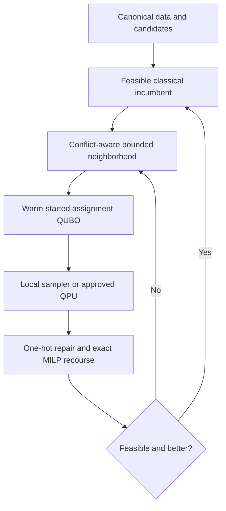

# WISER–Nestlé Distributed Order Management optimizer

This repository implements a scalable, feasibility-preserving hybrid optimizer for
the 2026 WISER Distributed Order Management (DOM) challenge. It combines a
transparent classical incumbent, bounded assignment QUBOs, optional quantum
sampling, and exact mixed-integer recourse.

The important guarantee is simple: a sampled assignment is never treated as a
business recommendation by itself. Exact recourse rebuilds fulfillment quantities,
the independent validator checks every hard rule, and the move is accepted only if
it is feasible and improves the incumbent. A weak or noisy sampler can waste time,
but it cannot make the returned recommendation worse.

## Why this hybrid

A monolithic QUBO for every order, SKU, DC, date, quantity, and resource would need
many logical variables, large penalty coefficients, and substantial embedding
overhead. Instead, this implementation uses quantum or quantum-inspired search only
where it may add value: proposing a coordinated reassignment inside a small,
resource-coupled neighborhood.



The detailed global model remains a mixed-integer linear program (MILP). The local
quadratic unconstrained binary optimization (QUBO) model represents one plan per
active order and adds calibrated penalties for one-hot violations and shared-resource
contention. Inventory, throughput, dock, pick, weight, volume, and the alternate-fill
rule are enforced exactly during recourse.

## Included implementation

- deterministic default-DC and sequential greedy baselines;
- exact SciPy/HiGHS MILP with optional fixed-assignment recourse;
- projected available-to-promise inventory that may decrease over the horizon;
- exact pallet/loose-case decomposition and supported operational capacities;
- the clarified divert rule: alternate fill must exceed default fill by at least
  five percentage points of total ordered cases;
- bounded large-neighborhood search with an incumbent warm start;
- incumbent-preserving candidate-column reduction for unusually wide orders;
- exact enumeration and reproducible simulated-annealing QUBO backends;
- optional, privacy-gated D-Wave QPU and Leap hybrid adapters;
- coefficient-noise sensitivity and synthetic scaling experiments;
- independent feasibility, objective, audit, and planner-view outputs.

No quantum advantage is claimed. The design creates a controlled place to test
whether a quantum sampler improves candidate discovery under equal neighborhood,
recourse, validation, seed, and runtime rules.

## Installation

Python 3.10 or newer is required.

```bash
python -m venv .venv
source .venv/bin/activate
python -m pip install --upgrade pip
python -m pip install -e ".[dev]"
```

Exact enumeration and simulated annealing are included in the base package. Install
`.[qpu,dev]` only inside an approved environment configured for D-Wave access.

## Reproduce the tiny exact result

```bash
python scripts/make_tiny_instance.py
python scripts/run_experiment.py \
  --data-dir data/synthetic/tiny \
  --methods default greedy classical hybrid \
  --hybrid-config configs/hybrid_tiny.yaml \
  --output-dir runs/tiny-comparison \
  --experiment-id tiny-comparison
pytest
```

The documented optimum is 126 synthetic units, with `O1` assigned to `D2` and
`O2` assigned to `D1`. Every run writes the normalized configuration, input
fingerprint, assignments, fulfillment, recomputed metrics, and validation report.
Detailed solver/search history is stored separately in `solver_metadata.json`.
The dedicated hybrid command also writes a one-page planner view:

```bash
python scripts/run_hybrid.py --config configs/hybrid_tiny.yaml
```

## Scaling and noise study

```bash
python scripts/run_scaling_study.py \
  --sizes 20,50,100 \
  --noise 0,0.01,0.05 \
  --output results/scaling_synthetic.csv
```

This generates independent synthetic data; it does not copy operational values.
For each size it compares the baselines, an exact MILP where configured, and the
hybrid method under QUBO coefficient perturbations. Report logical QUBO variables,
couplings, exact-recourse calls, feasibility, objective, and runtime—not physical
qubit count alone.

## Provided challenge files

The two supplied recommendation CSVs are readable and reconcile exactly at order
and SKU level. The aggregate-only audit found 1,109 orders, 25,193 order-SKU rows,
615 loads, eight DC labels, three diversions, and a case fill rate of 94.4997%.
Commercial totals and raw identifiers are deliberately omitted.

```bash
python scripts/audit_challenge_outputs.py \
  /approved/path/Output_order_level_data.csv \
  /approved/path/output_order_sku_level_data.csv
```

The remaining uploaded “input” files are AppleDouble metadata sidecars, not the
underlying CSV, workbook, or Word content. Therefore the incumbent outputs can be
audited, but alternative-DC inventory, cost, eligibility, and capacity decisions
cannot honestly be reconstructed from this upload. Re-export the original files
without `._`/AppleDouble wrappers and map them to the canonical contract before a
real-data optimization run. See [challenge data status](docs/challenge_data.md).

## Quantum execution and privacy

Remote execution is disabled by default. Integer variable labels prevent raw order,
SKU, or DC identifiers from becoming remote labels, but QUBO coefficients can still
encode sensitive economics and constraints. Use `allow_remote: true` only after the
data owner explicitly approves the destination and payload. The classical and local
simulated-annealing workflows require no external solver service.

## Documentation

- [Hybrid algorithm and scaling](docs/hybrid_algorithm.md)
- [Mathematical formulation](docs/mathematical_formulation.md)
- [Research basis and solver choice](docs/research_basis.md)
- [Canonical data dictionary](docs/data_dictionary.md)
- [Challenge data status](docs/challenge_data.md)
- [Assumptions](docs/assumptions.md)
- [Experiment protocol](docs/experiment_protocol.md)
- [Measured synthetic scaling/noise study](results/scaling_synthetic.md)
- [Privacy policy](docs/privacy.md)
- [Submission-ready report sources](reports/README.md)

The implementation follows hybrid local-search and warm-start principles described
by [Tomesh et al.](https://doi.org/10.22331/q-2022-08-22-781) and
[Egger et al.](https://doi.org/10.22331/q-2021-06-17-479), while treating claims
about present-day industrial quantum advantage conservatively.
