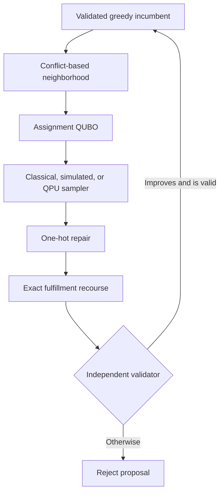

# Distributed Order Management Solver

**Author:** Andrei Pomorov

This repository contains a validated hybrid optimization system for the Nestlé WISER
Quantum Challenge. It decides whether an order should remain at its default distribution
center (DC), move to an eligible alternative DC and ship date, or remain unassigned, and
then determines how many cases of every stock-keeping unit (SKU) can be fulfilled.

The recommended production path is entirely classical and license-free. Quantum
optimization is an experimental proposal engine inside a safeguarded hybrid workflow;
every proposal is repaired, re-optimized by an exact recourse model, and independently
validated before it can replace the current solution.

## Results at a glance

The reviewed study contains 247 aggregate experiment rows across 14 experiment
families. All 247 rows passed the independent validator with zero recorded
demand-balance, integrality, inventory, and capacity residuals. The row-level evidence
tables and manifests are intentionally not published in this branch.

On the common 20-assignment-group real-data subset:

| Method | Objective capture | Case fill | Runtime | Role |
|---|---:|---:|---:|---|
| Default routing | 61.39% | 64.21% | 0.30 s | Business baseline |
| Greedy | 64.90% | 68.50% | 0.76 s | Fast assignment heuristic |
| Polished greedy | 64.90% | 68.50% | 2.86 s | Recommended production default |
| Exact LNS | 64.90% | 68.50% | 7.00 s | Quality escalation |
| Full exact MILP | 64.90% | 68.50% | 2.76 s | Small-instance certificate |
| Hybrid simulated annealing | 64.90% | 68.50% | 12.88 s | Experimental comparator |

Objective capture is the achieved objective divided by the total requested merchandise
value. Case fill is fulfilled cases divided by requested cases. The optimization
objective is:

$$
\text{fulfilled value} - \text{unmet-demand penalty} - \text{shipping cost}.
$$

These results do not establish quantum advantage. On a synthetic coordination control,
exact LNS, exact MILP, simulated annealing, and local QAOA all escaped a verified greedy
trap by 197.2 objective units. On IBM hardware, every returned decision became feasible
after exact recourse, but native one-hot feasibility and raw QUBO quality degraded with
circuit depth. The hardware study therefore supports safe integration and identifies
depth limits; it does not show a speed or quality advantage over classical methods.

## Recommended solver hierarchy

1. Use `mode="fast"` for routine planning. It applies load-atomic greedy routing and
   exact fixed-assignment quantity recourse.
2. Use `mode="quality"` when coupled inventory or dock conflicts justify more search.
   It applies adaptive exact large-neighborhood search (LNS).
3. Use `mode="hybrid"` for research. A sampler proposes coordinated assignment moves,
   while exact recourse and the validator retain control of feasibility.
4. Use full exact mixed-integer linear programming (MILP) only for small instances,
   benchmarking, or optimality certificates.

## How the hybrid solver works



The quantum unconstrained binary optimization (QUBO) model contains only bounded local
assignment choices. It uses one-hot groups, meaning exactly one candidate is selected
for each active assignment group. Gate-model QAOA uses:

- a product of weight-one Dicke, or W, states that starts in the feasible one-hot
  subspace;
- a connected XY path mixer that preserves one excitation per group with fewer logical
  two-qubit interactions than the earlier ring implementation;
- locally optimized parameters that are reused across matched IBM mitigation variants;
- exact feasible-state, uniform-feasible, and classical controls;
- Wilson confidence intervals, near-optimal rates, and normalized energy gaps in
  addition to rare exact-hit counts.

QAOA means Quantum Approximate Optimization Algorithm. A mixer is the circuit component
that moves probability between candidate solutions. Exact recourse is a MILP with the
sampled assignments fixed and fulfillment quantities re-optimized. This separation
ensures that the sampler proposes assignments but never bypasses business constraints.

## Repository structure

| Path | Purpose |
|---|---|
| `src/domopt/` | Solver package: data loading, rules, baselines, MILP, LNS, QUBO/QAOA, validation, metrics, and provenance |
| `notebooks/` | Run-all experiment notebook, including optional Gurobi and IBM studies |
| `scripts/` | Supported command-line entry points for bundle preparation, studies, audits, and synthetic examples |
| `tests/` | Unit, integration, privacy, notebook, and validator regression tests |
| `docs/` | Data guide, assumptions, formulation, method, reproducibility protocol, and challenge checklist |
| `results/final/figures/` | Screened aggregate, normalized, synthetic, robustness, and QAOA figures |
| `reports/` | Final paper, two-page summary, one-page planner view, and presentation |
| `data/synthetic/` | Shareable generated examples; restricted challenge data are intentionally excluded |

## Terminology

| Term | Meaning in this repository |
|---|---|
| Assignment group | Orders that must move together as one load-level routing decision |
| Candidate | One eligible DC and planned-goods-issue date option for an order |
| Case fill rate | Fulfilled cases divided by requested cases |
| Cumulative ATP | Cumulative available-to-promise inventory through a date |
| DC | Distribution center from which an order may ship |
| Divert or reassignment | Moving an order away from its default DC |
| Feasible | Satisfies schema, assignment, demand, eligibility, inventory, and capacity checks |
| HiGHS | Open-source MILP solver used through SciPy; the default exact backend |
| LNS | Large-neighborhood search, which repeatedly re-optimizes a bounded subset of decisions |
| MILP | Mixed-integer linear program with continuous and integer decision variables |
| Objective capture | Objective value divided by total requested merchandise value |
| PGI | Planned goods issue, the modeled ship date |
| QAOA | Gate-model variational quantum optimization algorithm |
| QUBO | Quadratic objective over binary variables used by local samplers and QAOA |
| Recourse | Exact re-optimization of fulfillment quantities after assignments are fixed |
| SKU | Stock-keeping unit, the item identifier at an order-line level |
| One-hot | Exactly one binary variable in a choice group equals one |

## Local installation

### Requirements

- Python 3.10, 3.11, or 3.12
- Git
- No commercial solver, GPU, or quantum account for the default workflow

The core code uses NumPy, pandas, SciPy, and PyYAML and is operating-system neutral.
Continuous integration covers Python 3.10-3.12 on Linux, macOS, and Windows. Use the
platform-specific virtual environment commands below.

### macOS or Linux

```bash
python3 -m venv .venv
./.venv/bin/python -m pip install --upgrade pip
./.venv/bin/python -m pip install -e ".[full]"
./.venv/bin/python -m pytest
```

### Windows PowerShell

```powershell
py -3.11 -m venv .venv
.\.venv\Scripts\python.exe -m pip install --upgrade pip
.\.venv\Scripts\python.exe -m pip install -e ".[full]"
.\.venv\Scripts\python.exe -m pytest
```

The `full` extra is the one-command installation for the notebook, solver cockpit,
native HiGHS and SCIP adapters, Gurobi adapter, IBM Runtime integration, development
checks, and GPU batch scoring on supported Linux and Windows architectures. Package
installation does not submit IBM jobs or require a Gurobi license; those backends remain
runtime opt-ins. Unsupported GPU platforms skip CuPy through environment markers, so the
same command is valid on Linux, macOS, and Windows.

The commands call the environment's Python directly, so shell activation is optional.
Conda users can install the same `full` environment with:

```bash
conda env create -f environment.yml
conda activate wiser-dom
```

## Quick validation with synthetic data

Generate the tiny shareable instance:

```bash
python scripts/make_tiny_instance.py --output-dir data/synthetic/tiny
```

Then use the validated solver facade:

```python
from domopt.data import load_problem_data
from domopt.solver import SolverConfig, solve_dom

problem = load_problem_data("data/synthetic/tiny")
solution = solve_dom(problem, config=SolverConfig(mode="fast"))

print(solution.raw_objective)
print(solution.assignments)
```

`solve_dom` refuses to return an invalid incumbent. The `fast`, `quality`, and `hybrid`
modes correspond to the hierarchy described above.

## Interactive solver cockpit

The optional Streamlit cockpit runs the same validated solver facade; it is not a
separate demonstration model. It audits the five canonical challenge inputs, exposes
portable CPU and MILP controls, explains the sparse LNS stages, visualizes business and
search telemetry, and exports a certified run bundle.

```bash
streamlit run apps/solver_cockpit.py
```

Set `DOMOPT_BUNDLE_DIR` to prefill the local bundle path. The app preserves the existing
input contract and never uploads challenge rows to a hosted service.

## Running the challenge study

Place the authorized five runtime tables under a local directory that is not committed.
The canonical inputs and their columns are documented in
[the data guide](docs/data_guide.md). To normalize downloaded filenames:

```bash
python scripts/prepare_challenge_bundle.py \
  --source-dir /path/to/downloads \
  --output-dir data/raw/nestle_challenge
```

The preparation command prints the exact follow-up command. Pass its `--output-dir` to
the study; do not accidentally replace a home-relative path such as `~/Wiser/...` with
the different root-relative path `/Wiser/...`.

Run a fast reproducibility check:

```bash
python scripts/run_challenge_study.py \
  --bundle-dir data/raw/nestle_challenge \
  --profile smoke
```

Run the complete final grid:

```bash
python scripts/run_challenge_study.py \
  --bundle-dir data/raw/nestle_challenge \
  --profile full
```

For an interactive, self-documenting workflow:

```bash
jupyter lab notebooks/nestle_challenge_experiments.ipynb
```

Edit only the global configuration cell and choose **Run All**. The notebook includes
solver comparison, real and synthetic scaling, candidate and penalty sensitivity,
inventory shocks, noise proxies, pruning and batching ablations, sampler controls, an
optional MILP-backend comparison, and an optional IBM hardware matrix.

## Optional exact-solver comparisons

The portable default remains SciPy/HiGHS. Two opt-in, open-source adapters make it
possible to compare the identical compiled MILP through native HiGHS and SCIP. Native
adapters automatically respect the CPU budget visible to the process; `--threads` can
apply a lower cap without assuming a particular machine.

```bash
python scripts/benchmark_milp_backends.py \
  --bundle-dir data/raw/nestle_challenge \
  --backends scipy-highs highspy scip
```

The benchmark writes no output unless `--output` is provided. OR-Tools CP-SAT is not an
exact drop-in comparator here because its model interface requires integer coefficients;
scaling currency and continuous resource coefficients would change the numerical
contract being compared.

### Optional Gurobi adapter

Gurobi can be useful for comparing solve time and optimality progress on the same exact
MILP, but it should not be the default because many reviewers will not have a license.
It is included in `full`; configure a valid Gurobi license, then run the notebook's
**Optional MILP-backend comparison** section. The notebook always runs SciPy/HiGHS,
runs Gurobi only when
available, validates both outputs, and asserts matching objectives when both complete.
An unavailable package or license is recorded as a skip.

## Optional IBM hardware study

The `full` installation includes the IBM dependencies. Configure IBM Quantum using the
official Qiskit Runtime mechanism. Hardware execution is disabled unless
`allow_remote=True` is explicit. The supplied study generates its
own synthetic coordination instance and does not transmit restricted challenge tables.

```bash
python scripts/run_ibm_hardware_study.py \
  --allow-remote \
  --profile quick
```

The final code caches one QAOA parameter vector per depth, uses a linear W-state
preparation circuit and a path mixer, performs several transpiler trials, and compares
depth and mitigation variants with exact and uniform-feasible controls.

## GPU support

A GPU is not needed to solve the challenge. The `full` installation includes CUDA 12
CuPy on supported Linux x86-64 and Windows AMD64 systems and skips it on unsupported
platforms. A CPU-only system still uses the same validated solver path.

GPU acceleration applies only to large batches of QUBO energy scoring and does not
replace the MILP or validator.

## Evidence, privacy, and provenance

Only screened aggregate submission artifacts are committed. Raw orders, customer data,
DC and SKU identifiers, source-currency commercial totals, CSV/JSON evidence, IBM job
tables, checkpoints, and manifests remain excluded. The two charts containing absolute
commercial totals are also excluded. The provenance code normalizes notebooks to
code-cell source, records relevant source dirtiness separately from general worktree
dirtiness, and prevents output autosaves from changing checkpoint identity.

## Documentation and submission files

- [Data guide](docs/data_guide.md)
- [Assumptions](docs/assumptions.md)
- [Mathematical formulation](docs/mathematical_formulation.md)
- [Hybrid solver method](docs/solver_method.md)
- [Reproducibility and privacy protocol](docs/reproducibility.md)
- [Challenge completion checklist](docs/challenge_checklist.md)

- Final research report: [Markdown](reports/final_report.md) and
  [PDF](reports/final_report.pdf)
- Two-page business and technical summary:
  [Markdown](reports/business_technical_summary.md) and
  [PDF](reports/business_technical_summary.pdf)
- One-page planner view: [Markdown](reports/planner_view.md) and
  [PDF](reports/planner_view.pdf)
- Final presentation: [PDF](reports/final_presentation.pdf) and
  [PowerPoint](reports/final_presentation.pptx)

## Limitations

- Full exact MILP was tested only on small common subsets.
- Local and hardware QAOA experiments use bounded synthetic or local neighborhoods, not
  the full real network.
- Exact repair and recourse can dominate sampler differences, so final feasibility is
  not evidence that raw quantum samples were high quality.
- The final path-mixer and linear-W circuit improvements require a new hardware run
  before any hardware-quality claim can be updated.

See [the final report](reports/final_report.pdf) for the literature review, experimental
design, complete interpretation, and future research directions.
