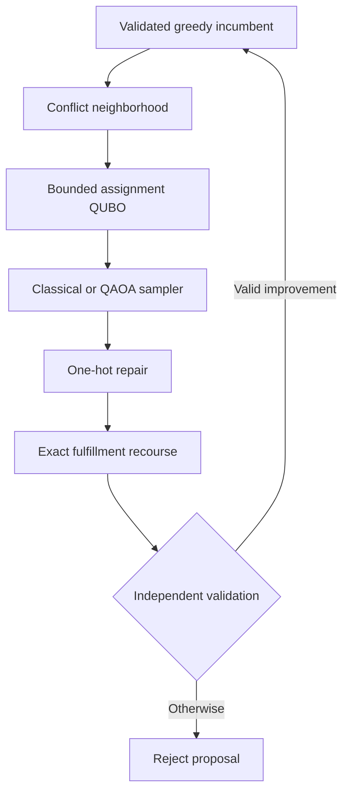

# Distributed Order Management Solver

**Author:** Andrei Pomorov

This repository contains a validated, scalable solver for the Nestlé WISER Quantum
Challenge. It decides whether an order stays at its default distribution center (DC),
moves to an eligible DC/date alternative, or remains unassigned, and then optimizes
fulfilled cases by stock-keeping unit (SKU).

The implementation is a feasibility-first hierarchy. Greedy routing provides a fast
incumbent; fixed-assignment recourse polishes quantities; adaptive exact
large-neighborhood search (LNS) coordinates difficult moves; and a bounded QUBO/QAOA
path can propose local assignments. Every returned plan must pass exact recourse and an
independent validator before it is accepted.

## Results at a glance

The final audited study contains **516 aggregate rows across 14 experiment families**.
Of those, 513 rows returned plans and all 513 passed the independent validator with zero
recorded demand-balance, integrality, inventory, and capacity residuals. The remaining
three rows are intentional frozen-routing controls whose infeasibility was proven at
60%, 65%, and 70% inventory reductions.

On the common **100-assignment-group real-data subset**:

| Method | Objective capture | Case fill | Runtime | Interpretation |
|---|---:|---:|---:|---|
| Default routing | 74.96% | 78.29% | 0.24 s | Business baseline |
| Greedy | 76.82% | 79.91% | 0.58 s | Fast routing incumbent |
| Polished greedy | 76.83% | 79.91% | 2.05 s | Exact quantity polish |
| Exact LNS | 76.83% | 79.91% | 13.22 s | Quality escalation |
| Full MILP, time-limited | 76.80% | 79.91% | 1.68 s | Small-scope comparator with nonzero gap |
| Hybrid simulated annealing | 76.83% | 79.91% | 55.74 s | Sampler-assisted research path |

Greedy improves objective capture by **1.86 percentage points** and case fill by **1.62
percentage points** over default routing. Exact polish and LNS retain the strongest
observed nominal frontier. On the coordinated synthetic trap, exact LNS, full MILP,
hybrid simulated annealing, and hardware-executed QAOA recover the same 197.2 synthetic
objective-unit improvement over greedy after recourse.

The scaling evidence strengthens the practical case for decomposition:

- all four scalable methods reach the full 372-group, 750-order real scope;
- median full-scope runtimes are 1.31 s for greedy, 4.82 s for polished greedy,
  26.14 s for exact LNS, and 101.17 s for hybrid simulated annealing;
- greedy and exact LNS scale to 100,000 generated orders; the hybrid path scales to
  20,000 while the largest local QUBO remains 32 variables;
- under a 70% inventory reduction, adaptive methods remain feasible and exact LNS
  retains the strongest normalized objective and service frontier.

Objective capture is achieved objective divided by total requested merchandise value.
Case fill is fulfilled cases divided by requested cases. The optimized objective is:

$$
\text{fulfilled value} - \text{unmet-demand penalty} - \text{shipping cost}.
$$

## Recommended solver hierarchy

1. Use `mode="fast"` for routine planning. It applies load-atomic greedy routing and
   exact fixed-assignment quantity recourse.
2. Use `mode="quality"` when shared inventory or capacity conflicts justify additional
   search. It applies adaptive exact LNS.
3. Use `mode="hybrid"` for research. A classical or quantum sampler proposes bounded
   assignment moves; exact recourse and validation control acceptance.
4. Use full MILP for small instances, benchmarking, and optimality progress. A
   time-limited incumbent is not labeled exact unless the recorded gap is zero.



The QUBO contains local assignment choices only. A product of weight-one Dicke/W states
starts gate-model QAOA in the feasible one-hot subspace, and a connected XY path mixer
moves amplitude between candidates while preserving one excitation per group. The
sampler proposes assignments; it never bypasses the detailed business constraints.

The final synthetic-only hardware study contains 18 QPU jobs at 8,192 shots per job.
For $p=1$, median raw one-hot feasibility is about 65.3% and the exact feasible-QUBO hit
rate is about 0.684%, above the 0.391% uniform-feasible control. The $p=2$ circuit is
roughly ten times deeper and performs worse, making shallow circuits the clear near-term
choice. All QPU-derived proposals recover the coordinated synthetic improvement after
exact recourse and validation.

## Repository structure

| Path | Purpose |
|---|---|
| `src/domopt/` | Loading, rules, baselines, MILP, LNS, QUBO/QAOA, validation, metrics, and provenance |
| `apps/solver_cockpit.py` | Interactive planner copilot backed by the validated solver facade |
| `notebooks/` | Run-all final experiment notebook, including optional GPU, MILP-engine, and IBM studies |
| `scripts/` | Bundle preparation, studies, audits, figure generation, and synthetic examples |
| `tests/` | Unit, integration, privacy, notebook, UI, and validator regression tests |
| `docs/` | Data guide, assumptions, formulation, method, reproducibility, and submission checklist |
| `results/final/` | Screened normalized, aggregate, and synthetic figures only |
| `reports/` | Technical paper, two-page summary, planner view, and presentation |
| `data/synthetic/` | Shareable generated examples; restricted challenge data are excluded |

## Install and validate

Requirements are Python 3.10-3.12 and Git. No commercial solver, GPU, or quantum
account is needed for the default workflow.

### macOS or Linux

```bash
python3 -m venv .venv
./.venv/bin/python -m pip install --upgrade pip
./.venv/bin/python -m pip install -e ".[full]"
./.venv/bin/python -m pytest
```

### Windows PowerShell

```powershell
py -3.11 -m venv .venv
.\.venv\Scripts\python.exe -m pip install --upgrade pip
.\.venv\Scripts\python.exe -m pip install -e ".[full]"
.\.venv\Scripts\python.exe -m pytest
```

The `full` extra installs notebook, Streamlit, native HiGHS/SCIP, opt-in Gurobi and IBM
Runtime integrations, development checks, and supported GPU scoring dependencies.
Package installation never submits IBM jobs or requires a commercial license.

Conda users can install the same environment with:

```bash
conda env create -f environment.yml
conda activate wiser-dom
```

## Quick synthetic validation

```bash
python scripts/make_tiny_instance.py --output-dir data/synthetic/tiny
```

```python
from domopt.data import load_problem_data
from domopt.solver import SolverConfig, solve_dom

problem = load_problem_data("data/synthetic/tiny")
solution = solve_dom(problem, config=SolverConfig(mode="fast"))

print(solution.raw_objective)
print(solution.assignments)
```

`solve_dom` refuses to return an invalid incumbent.

## Use the interactive planner copilot

The Streamlit solver cockpit is the project’s planner-facing copilot. It runs the same
validated solver facade as the Python API and does not upload challenge rows to a hosted
service.

```bash
streamlit run apps/solver_cockpit.py
```

In the browser:

1. Paste the directory containing the five canonical CSV inputs into **Challenge bundle
   directory**. The text in white entry fields is intentionally dark and remains
   visible while you type.
2. Choose **Fast**, **Quality**, or **Hybrid**. Fast is the routine default; Quality
   adds exact LNS; Hybrid enables the bounded sampler-assisted path.
3. Choose the **MILP backend** and CPU budget. Leave the portable SciPy/HiGHS defaults when
   unsure.
4. Optionally set the assignment-group limit, time budget, and random seed.
5. Select **Run and certify**. The app audits inputs first, solves, then runs the
   independent validator.
6. Review the plan, normalized business metrics, constraint residuals, and search
   telemetry. Download the certified bundle only after the validation panel is green.

Set `DOMOPT_BUNDLE_DIR` to prefill the path. If an already-open browser tab still shows
white-on-white text after updating this branch, perform a hard refresh so Streamlit
loads the corrected stylesheet.

## Run the full challenge study

Place the authorized five runtime tables in a local directory that is not committed.
The canonical inputs are documented in the [data guide](docs/data_guide.md). Normalize
downloaded filenames when needed:

```bash
python scripts/prepare_challenge_bundle.py \
  --source-dir /path/to/downloads \
  --output-dir data/raw/nestle_challenge
```

Run a fast check, then the complete final grid:

```bash
python scripts/run_challenge_study.py \
  --bundle-dir data/raw/nestle_challenge \
  --profile smoke

python scripts/run_challenge_study.py \
  --bundle-dir data/raw/nestle_challenge \
  --profile full
```

Or open `notebooks/nestle_challenge_experiments.ipynb`, edit only the global
configuration cell, and choose **Run All**. Its checked-in full profile matches the
final evidence grid. The IBM switch remains `False` to prevent accidental remote work.

## Optional solver and hardware comparisons

SciPy/HiGHS is portable and remains the default. Native HiGHS and SCIP can solve the
same compiled MILP; Gurobi is used only when installed and licensed:

```bash
python scripts/benchmark_milp_backends.py \
  --bundle-dir data/raw/nestle_challenge \
  --backends scipy-highs highspy scip
```

The final IBM experiment sends an independently generated synthetic circuit only. It
requires configured Qiskit credentials and the explicit privacy gate:

```bash
python scripts/run_ibm_hardware_study.py \
  --allow-remote \
  --backend ibm_marrakesh \
  --profile presentation \
  --shots 8192
```

Queue time is operational latency, not compute time. The publication chart therefore
uses a logarithmic end-to-end runtime axis, labels medians, and overlays individual job
dots so long queue outliers do not hide the typical runs.

## Evidence, privacy, and provenance

Only screened aggregate, normalized, or synthetic figures are committed. Raw orders,
customer data, DC/SKU identifiers, source-currency commercial totals, evidence CSV/JSON,
IBM job tables, queue snapshots, checkpoints, and manifests remain local-only. Synthetic
controls are labeled and are never presented as business impact.

The full experiment runner records configuration, problem and bundle fingerprints,
dependency versions, source state, seed, validation residuals, row count, and hashes in
local manifests. The publication script accepts audited local evidence paths and writes
only screened figures.

## Submission artifacts

| Deliverable | Files |
|---|---|
| Technical report | `reports/final_report.md` and `.pdf` |
| Two-page business/technical summary | `reports/business_technical_summary.md` and `.pdf` |
| One-page planner view | `reports/planner_view.md` and `.pdf` |
| Presentation | `reports/final_presentation.pptx` and `.pdf` |
| Runnable experiment notebook | `notebooks/nestle_challenge_experiments.ipynb` |

Editable DOCX renderings are generated locally by
`scripts/build_submission_documents.py`; they are reproducible derived files and are
therefore excluded from version control. The builder requires `python-docx` and Pandoc;
Pandoc converts every Markdown LaTeX expression to native Word Office Math (OMML), so
subscripts, superscripts, sums, products, fractions, sets, and ket notation remain
properly typeset in both DOCX and PDF output.

Supporting documentation:

- [Data guide](docs/data_guide.md)
- [Assumptions](docs/assumptions.md)
- [Mathematical formulation](docs/mathematical_formulation.md)
- [Solver method](docs/solver_method.md)
- [Reproducibility and privacy](docs/reproducibility.md)
- [Challenge completion checklist](docs/challenge_checklist.md)

## Limitations and next evidence

- The real-data study is an offline historical evaluation; a controlled shadow-mode
  pilot is still required before operational deployment.
- Full MILP is practical only on small common subsets under the tested budget; its
  time-limited 100-group run retained a nonzero optimality gap.
- Hardware QAOA is tested on a 16-variable synthetic control, while real and large
  generated scaling use classical samplers.
- Exact recourse can equalize final outcomes even when raw sampler quality differs, so
  raw sampling and post-recourse plan quality are reported separately.
- The evidence does not establish hardware superiority; it establishes a safe architecture,
  an above-uniform shallow-circuit signal, and measurable depth and queue constraints.

See the [paper](reports/final_report.pdf) for the conducted research.
