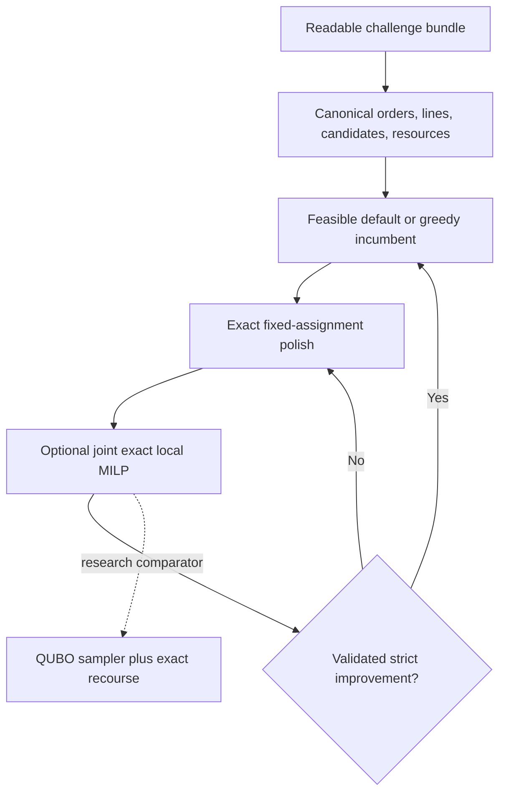

# WISER–Nestlé Distributed Order Management optimizer

This branch is the experiment-ready implementation for the 2026 WISER–Nestlé
Distributed Order Management (DOM) challenge. It reads the supplied proof-of-concept
data, constructs a validated optimization instance, compares transparent classical
baselines with exact MILP, adaptive exact-MILP neighborhood search, and an
experimental hybrid quantum-classical search, and persists
aggregate tables and figures. Final reports, planner PDFs, and slides are deliberately
deferred until the full experiment profile has produced reviewed results.

The measured production default is polished greedy: deterministic whole-load routing
followed by exact fixed-assignment quantity recourse. Adaptive exact large-neighborhood
search (LNS) is the quality escalation when coordinated reassignment is worth more
runtime. In the experimental quantum path, a QUBO sample is only a proposal. Exact
mixed-integer recourse rebuilds SKU quantities, an independent validator checks all
hard constraints, and a move is accepted only when it is feasible and improves the
current solution. A weak or noisy sampler can consume runtime, but it cannot worsen
the returned incumbent.

## What is implemented

- fail-closed file, schema, type, domain, date, and inventory-identity checks for
  the five runtime input CSVs;
- a cleanup command that removes numbered-upload names and retains only runtime
  inputs plus two optional recommendation outputs;
- a real-data adapter for orders, inventory, lanes, dock availability, and throughput
  observations;
- source-accurate case conversion and thresholded order-penalty logic;
- load-cohesive candidate generation, five-day protected ATP, shipping lead times,
  working-day PGI adjustment, forecast eligibility, and dock usage;
- deterministic load-atomic default, sequential-greedy, and polished-greedy
  baselines;
- an exact SciPy/HiGHS mixed-integer linear program (MILP);
- adaptive conflict-graph exact LNS with a precomputed group index, resource-
  residualized local models, joint assignment/quantity optimization, variable
  budgets, and independently validated strict-improvement acceptance;
- bounded large-neighborhood search with QUBO assignment proposals and exact MILP
  fulfillment recourse;
- full and feasible-subspace exact enumeration, random sampling, simulated
  annealing, a local constraint-preserving QAOA statevector simulator, and an optional
  IBM Quantum backend behind an explicit privacy gate;
- an independent objective evaluator and feasibility validator;
- all requested experiments, business- and QUBO-penalty sweeps, and additional
  controls;
- stable, profile-scoped notebook checkpoints with content-hash manifests under
  `results/challenge-study/notebook/` and separate CLI evidence under
  `results/challenge-study/cli/`;
- an opt-in synthetic CPU/GPU crossover benchmark and privacy-gated hardware tests; and
- a runnable Jupyter notebook and aggregate-only Streamlit planner copilot.

No corrected IBM result is committed and no quantum advantage is claimed. Supplied
historical hardware evidence is audited separately and is not publication-ready.

The implementation audit, unresolved owner decisions, and method comparison are in
[the results audit](docs/results_audit.md). The complete lineage decision is in the
[branch comparison](docs/branch_comparison.md).

## Supplied-data audit boundary

The strict loader verifies all five required runtime files, their required fields and
domains, their cross-table model invariants, and the inventory reconciliation before
solving. Optional recommendation outputs are used only for reconciliation and never
as optimization labels. Exact source-scale totals remain in ignored local artifacts;
the public repository reports only reviewed normalized/indexed evidence. The
challenge PDF, equations document, and workbook are references, not runtime inputs.

## Solver architecture



The exact model assigns each order to one eligible DC/PGI option or leaves it
unassigned. Partial fulfillment is allowed at the selected DC, but an order cannot
split across DCs. Orders sharing a source load move together. The objective is:

$$
\text{fulfilled value}-\text{thresholded unmet penalty}-\text{shipping cost}.
$$

Hard constraints cover demand balance, candidate eligibility, projected inventory,
dock capacity, optional scenario capacity, the diversion-uplift rule, pallet/case
accounting, and assignment-group cohesion. See the
[mathematical formulation](docs/mathematical_formulation.md) and
[source mapping](docs/poc_data_mapping.md).

`solve_dom` exposes the final method hierarchy through one validated API:

```python
from domopt import SolverConfig, solve_dom

solution = solve_dom(problem, config=SolverConfig(mode="fast"))
# mode="quality" enables adaptive exact LNS;
# mode="hybrid" keeps sampler/IBM search experimental.
```

Every mode is independently validated before it can return a solution.

## Installation

Python 3.10 or newer is required.

```bash
python -m venv .venv
source .venv/bin/activate
python -m pip install --upgrade pip
python -m pip install -e ".[dev,notebook,app]"
```

Optional extras are `.[gpu]` for CUDA 12 CuPy benchmarking, `.[ibm]` for IBM
Quantum, and `.[full]` for the complete workstation environment. The default solver remains
local and CPU-based because exact recourse and small local QUBOs dominate the current
workload.

## Prepare the challenge bundle

Keep raw files outside Git. Browser downloads commonly add suffixes such as `(1)`
and macOS archives add metadata sidecars. Create a clean directory with stable names:

```bash
python scripts/prepare_challenge_bundle.py \
  --source-dir /approved/path/to/downloads \
  --output-dir data/raw/nestle_challenge
```

The resulting directory contains five required inputs:

- `input_order_data.csv`
- `input_capacity_planning.csv`
- `input_shipping_cost_data.csv`
- `input_dock_capacity.csv`
- `input_throughput_capacity.csv`

When available, the script also retains `output_order_level_data.csv` and
`output_order_sku_level_data.csv` for optional reconciliation. It excludes the PDF,
DOCX, XLSX, screenshots, ZIP files, numbered duplicates, and AppleDouble metadata.

## Run the challenge study

Point the command to the cleaned directory:

```bash
python scripts/run_challenge_study.py \
  --bundle-dir /approved/path/to/challenge-files \
  --profile full
```

The command first validates every required file and stops on the first missing,
unreadable, empty, malformed, nonfinite, or structurally invalid artifact.
`--profile smoke` runs a short development grid; `--profile full` runs the evidence
grid. Source provenance is always recorded without blocking execution on worktree
state. CLI tables, manifests, and PNG charts are written below
`results/challenge-study/cli/<profile>/`; notebook artifacts cannot overwrite them.

## Current evidence and solver choice

The supplied clean full study produced 247 feasible rows across 14 experiment families
with zero reported validation violations. All 18 CSV-manifest hashes pass and its
numeric identities reconcile within `7.5e-9`. It predates the new numeric validator
residual fields, so a fresh run is still required for final evidence. The archive
establishes this method hierarchy:

| Method | Observed result on the common real subset | Role |
|---|---|---|
| Greedy | 64.8961% objective capture in 0.755 s | Time-critical first incumbent |
| Polished greedy | 64.9002% in 2.715 s | Recommended production default |
| Exact MILP | Same capture in 2.518 s with zero reported gap | Small-instance certificate |
| Exact LNS | Same capture in 6.565 s | Coordinated-assignment quality escalation |
| Hybrid sampler LNS | Same capture in 12.149 s with zero accepted sampler moves | Research comparator only |

At 372 assignment groups/750 orders, polished greedy takes 51.779 seconds. Exact LNS
takes 71.208 seconds and improves it by only `0.000027%`. Across
the real scaling grid, 98.87% of LNS's aggregate gain over raw greedy comes from the
initial polish. Hybrid is tested only through 50 groups and contributes zero post-polish
gain in every repeated real-subset row.

## Run the notebook

```bash
jupyter lab notebooks/nestle_challenge_experiments.ipynb
```

Use **Run All** after editing the global configuration cell immediately below the
automatic dependency bootstrap. The kernel adds the local package and installs missing
notebook dependencies, so no terminal commands or terminal-set environment variables
are required. The default bundle is `data/raw/nestle_challenge`; profiles, experiment
switches, rerun policy, GPU, and every IBM setting are together in that one cell. The
notebook performs and checkpoints:

1. strict bundle and output reconciliation audits;
2. default, greedy, polished greedy, exact LNS, exact MILP, and hybrid comparison;
3. repeated real assignment-group scaling;
4. repeated controlled synthetic scaling;
5. candidate-DC universe sensitivity;
6. business and QUBO penalty sensitivity;
7. candidate-count sensitivity and inventory shocks;
8. sampler seed/local coefficient sensitivity, a QAOA readout-noise proxy, and
   algorithm ablations;
9. Pareto-pruning and random-versus-conflict batching ablations;
10. feasible exact, random, simulated-annealing, and Dicke/XY-QAOA controls;
11. a synthetic coordination control with a known exact reference;
12. an optional end-to-end CPU/GPU QUBO-scoring crossover; and
13. optional synthetic-only IBM backend discovery and a matched Dicke/XY-QAOA
    hardware stress test.

All persisted experiment rows are aggregate-only.

Notebook checkpoints, aggregate tables, and figures are written directly below the
stable path `results/challenge-study/notebook/<profile>/`; identity and content hashes
remain in the adjacent manifests.

## Run the IBM hardware study

The opt-in hardware study derives the needed logical-qubit width, records all accessible
operational backends, and uses the least-busy eligible device unless a backend is
specified. It evaluates a coupled synthetic instance with exact and local simulator
references—not Nestlé coefficients. Provenance is recorded without a dirty-worktree
gate or escape flag.

```bash
python scripts/run_ibm_hardware_study.py \
  --allow-remote \
  --profile presentation \
  --shots 512
```

It runs the full $p=1/p=2$ by baseline/dynamical-decoupling/DD-plus-measurement-
twirling matrix: six QPU jobs in `quick`, eighteen in `presentation`. Saved evidence
separates exact feasible-QUBO raw hit rate from repaired/recourse validity and records
job IDs/timestamps, circuit cost, compilation, submit/wait, queue, execution, quantum-
use, decode, recourse, and end-to-end timing. Successful variants resume; failed rows
are retained and retried instead of aborting the matrix.

## Run the planner copilot

The copilot is useful because the experiment matrix is multi-dimensional and planners
need explanations, not raw solver logs. It is deliberately rules-based: no external
language model receives the data, and identifier-bearing uploads are rejected.

```bash
python -m streamlit run apps/planner_copilot.py
```

It explains solver comparisons, scaling, sensitivities, ablations, and the limits of
the evidence. See [app instructions](apps/README.md).

## Reproduce the known-optimum test

```bash
python scripts/make_tiny_instance.py
python scripts/run_experiment.py \
  --data-dir data/synthetic/tiny \
  --methods default greedy polished_greedy exact_lns classical hybrid \
  --hybrid-config configs/hybrid_tiny.yaml \
  --output-dir runs/tiny-comparison \
  --experiment-id tiny-comparison
pytest
```

The tiny instance has a proven optimum of 126 synthetic units. The exact MILP and
hybrid exact-QUBO configuration both reproduce it.

## Repository map

| Path | Purpose |
|---|---|
| `src/domopt/poc.py` | runtime-bundle cleanup, audit, and source adapter |
| `src/domopt/classical.py` | exact MILP and fixed-assignment recourse |
| `src/domopt/hybrid.py` | adaptive exact LNS plus sampler-assisted LNS |
| `src/domopt/solver.py` | validated `fast`, `quality`, and experimental `hybrid` entry point |
| `src/domopt/checkpoints.py` | stable-profile checkpoints with content/identity manifests |
| `src/domopt/validation.py` | independent feasibility authority |
| `src/domopt/experiments.py` | complete experiment matrix |
| `src/domopt/hardware.py` | privacy-safe hardware discovery and GPU benchmark |
| `notebooks/` | runnable challenge analysis |
| `apps/` | aggregate-only planner copilot |
| `docs/` | data, assumptions, formulation, algorithm, and requirement mapping |
| `reports/` | deferral notice and planner sign-off template |
| `tests/` | unit, model, sampler, audit, privacy, and Markdown checks |

## Deferred submission artifacts

The requirement matrix, experiment protocol, and literature basis are available now.
The separate two-page summary, final report, data-specific planner view, and presentation are intentionally
absent and must not be rendered or described as final until the full profile and any
approved hardware runs have been reviewed.

## Privacy and interpretation

Raw operational rows, identifiers, exact DC-level resources, and commercial totals
are excluded from Git. QUBO variable labels are integers for optional remote runs,
but coefficients can still encode sensitive economics; remote execution therefore
requires explicit approval. See [privacy policy](docs/privacy.md).

The supplied throughput file reports observed utilization rather than a documented
maximum. It is not enforced as a real hard limit. Experiments may add explicit
scenario headroom, and those rows are labeled as scenarios. Likewise, local QUBO
coefficient perturbation is a ranking-robustness test, while the local QAOA bit-flip
control covers only readout; neither is a complete physical QPU noise model.
