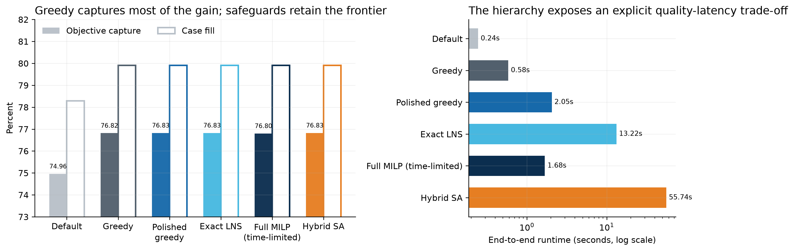
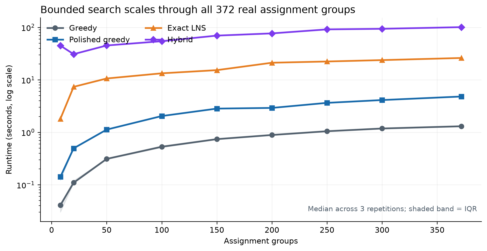
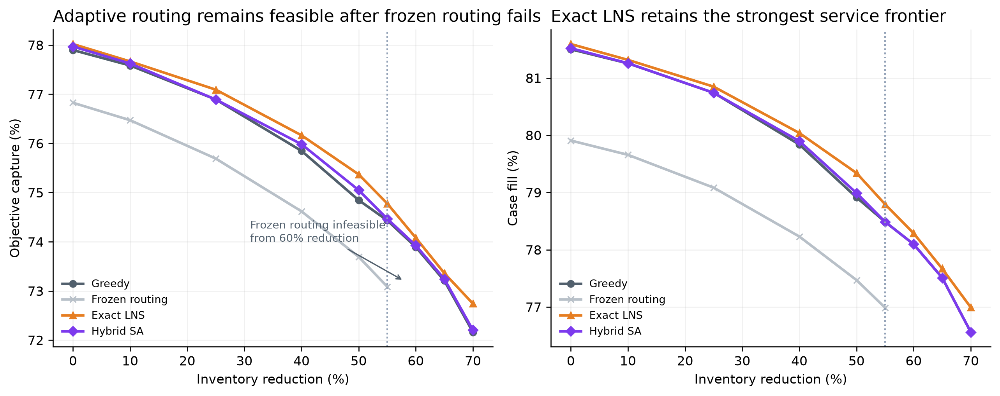
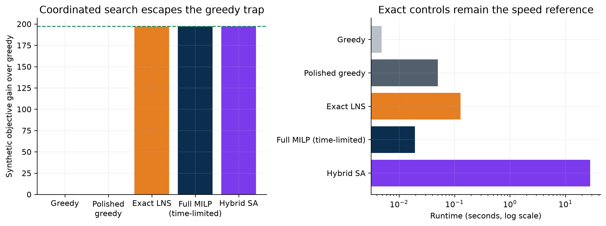
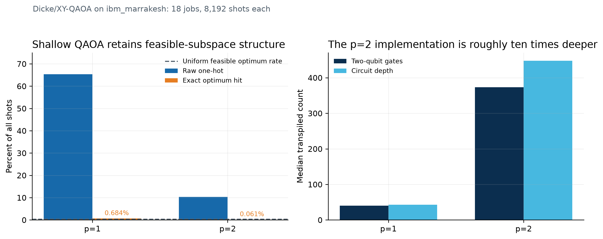
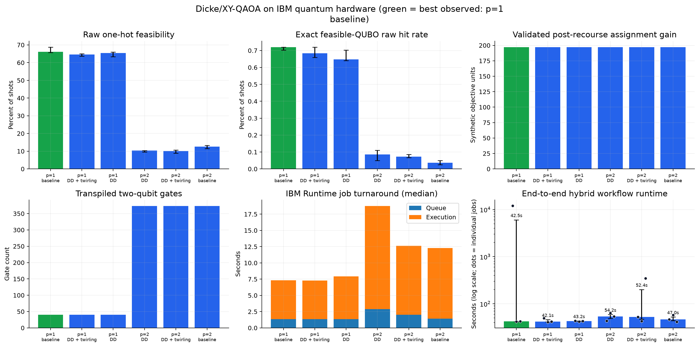

# A Scalable Safeguarded Hybrid Classical-Quantum Solver for Distributed Order Management

## Exact Recourse, Adaptive Neighborhood Search, and Bounded Quantum Proposals

**Andrei Pomorov**

**August 2026**

## Abstract

Distributed order management (DOM) jointly chooses a distribution center and
planned-goods-issue date for each order while allocating integer case quantities under
shared, time-phased inventory and operational capacity. The resulting problem is
combinatorial, but its output must also satisfy exact demand balance, load cohesion,
eligibility, cumulative available-to-promise (ATP), capacity, diversion, and integrality
requirements. We present a scalable, feasibility-first hierarchy consisting of
deterministic load-atomic greedy construction, exact fixed-assignment recourse, adaptive
mixed-integer large-neighborhood search (LNS), and an experimental sampler-assisted
neighborhood search. The sampler may use exact enumeration, random sampling, simulated
annealing, local constraint-preserving QAOA, or hardware-executed QAOA; it proposes only
a bounded local assignment move. Deterministic one-hot repair, exact recourse, a strict
improvement test, and an independent validator retain authority over the operational
plan.

The final study contains 516 aggregate rows across 14 experiment families. All 513
returned solutions passed independent validation with zero recorded demand-balance,
integrality, cumulative-inventory, and enabled-capacity residuals; three frozen-routing
controls were correctly proven infeasible under inventory reductions of 60-70%. On a
common 100-assignment-group real-data subset, greedy routing improved objective capture
by 1.859 percentage points and case fill by 1.619 percentage points over default routing
in 0.58 seconds. Exact quantity polishing added 0.0085 percentage points of objective
capture. Exact LNS and hybrid search retained the strongest observed incumbent, while a
time-limited full MILP returned a lower incumbent with a nonzero gap. At all 372 real
assignment groups, median runtime was 1.31 seconds for greedy, 4.82 seconds for polished
greedy, 26.14 seconds for exact LNS, and 101.17 seconds for hybrid search. On generated
instances, greedy and exact LNS scaled to 100,000 orders in median times of 39.16 and
276.71 seconds; hybrid search scaled to 20,000 orders while the local QUBO remained 32
variables.

An 18-job IBM study used 8,192 shots per job on the `ibm_marrakesh` quantum processor.
Shallow $p=1$ QAOA compiled to median depth 43 with 40 two-qubit gates and achieved a
65.34% median raw one-hot rate and 0.6836% median exact-optimum hit rate, compared with a
0.3906% uniform-feasible null. At $p=2$, median depth increased to 448 with 373
two-qubit gates, one-hot feasibility fell to 10.36%, and the optimum-hit median fell to
0.0610%. All hardware-derived final plans nevertheless recovered the 197.2-unit
coordinated synthetic improvement after exact recourse and validation. The evidence
establishes a practical scalable solver and a falsifiable path for bounded quantum
proposals.

**Keywords:** distributed order management; available to promise; mixed-integer
optimization; large-neighborhood search; QUBO; QAOA; hybrid quantum-classical
optimization; exact recourse; feasibility validation

## 1. Introduction

A DOM system must determine not only whether an order can ship, but which eligible
origin and ship date should serve it, how many cases of every stock-keeping unit (SKU)
should be fulfilled, and whether a reassignment is valuable enough to justify
transportation and operational disruption. These choices interact through cumulative
inventory checkpoints, dock and throughput capacity, common-load requirements, and
thresholded service penalties. A locally attractive reassignment can consume inventory
needed by another order, while order-by-order routing can split a load that must move
atomically.

This structure produces a mixed discrete-continuous optimization problem. Assignment
decisions are combinatorial; fulfillment quantities are integer; inventory is
time-coupled; and the returned plan must remain valid under detailed operational rules.
Classical ATP and order-fulfillment research therefore relies on mixed-integer
formulations [1-3]. Full MILP provides strong modeling and bounds, but expanding every
order-candidate-SKU combination can become expensive as the planning window grows.

Neighborhood methods address this difficulty by preserving an incumbent and exposing
only a bounded subset of decisions. Large-neighborhood search, local branching, and
relaxation-induced neighborhood search share this principle [4-6]. Quantum local search
uses an analogous decomposition: a quantum routine proposes a move inside a classical
outer loop rather than representing the complete operational system [13].

The solver presented here is designed around that separation. A fast classical path
produces a feasible incumbent. Exact recourse optimizes quantities for fixed
assignments. Exact LNS reopens only interacting groups when additional quality is worth
the latency. A QUBO/QAOA layer may replace the local proposal mechanism, but it cannot
bypass repair, exact recourse, or independent global validation.

### 1.1 Contributions

This work makes six contributions:

1. A documented MILP for load-atomic assignment, partial fulfillment, thresholded
   penalties, protected cumulative ATP, optional capacities, and minimum alternate-fill
   improvement.
2. A scalable hierarchy from deterministic construction to exact local
   re-optimization, with a portable SciPy/HiGHS default and optional native HiGHS, SCIP,
   and Gurobi solver engines.
3. A bounded hybrid proposal layer in which local QUBO width is decoupled from the
   number of global orders.
4. A gate-model implementation using linear W-state preparation, a connected XY path
   mixer, reusable optimized angles, exact feasible-state controls, and
   uncertainty-aware sampling metrics.
5. An independent validator and provenance system that recompute feasibility and the
   objective instead of trusting solver status or sampler energy.
6. A broad evidence suite with repeated real and generated scaling, robustness,
   sensitivity, ablation, GPU scoring, local QAOA, and IBM hardware experiments.

## 2. Related work

Optimization-based ATP coordinates order acceptance and allocation against multi-stage
resource availability [1]. Distribution-network fulfillment models add logistics,
inventory, and service decisions [2], while modern e-fulfillment formulations continue
to use mixed-integer models for assignment, splitting, and delivery-window trade-offs
[3]. These models motivate the exact constraint layer used here.

The scalable classical method is related to LNS [4], local branching [5], and
relaxation-induced neighborhood search [6]. Unlike a generic destroy-and-repair
procedure, the neighborhoods here are chosen from a sparse resource-conflict index,
residualized against the incumbent, and solved with the same business formulation used
for full MILP.

QAOA alternates a cost unitary and mixer to sample low-energy binary states [7]. The
Quantum Alternating Operator Ansatz generalizes QAOA to constraint-preserving initial
states and mixers [8]. A one-hot assignment group can be represented by a weight-one
Dicke state and an XY mixer [9,10]. Parameter choice and hardware depth remain central
limitations [11]; warm starts and local-search embeddings seek to reduce that burden
[12,13]. This study adopts the local-search interpretation and compares quantum
proposals with exact and strong classical controls.

## 3. Problem definition

### 3.1 Sets and data

Let $\mathcal O$ be orders, $\mathcal G$ assignment groups, $\mathcal S_o$ SKUs in order
$o$, $\mathcal C_o$ eligible DC/PGI candidates, $\mathcal T$ inventory checkpoints, and
$\mathcal R$ enabled resources. Orders in one source load belong to the same assignment
group and must select one common outcome. A candidate includes distribution center
$d(c)$, PGI date $\tau(c)$, shipping cost $C_c$, eligibility state, and fixed resource
coefficients. Demand for order $o$ and SKU $s$ is $Q_{os}$, unit value is $v_{os}$, and
protected cumulative ATP at $(d,s,t)$ is $A_{dst}$.

The supplied model contains 750 modeled orders, 372 assignment groups, 20,869 order
lines, and 2,182 unpruned candidate rows. A heuristic Pareto reduction removes 875
candidate rows, but it remains opt-in because isolated dominance is not globally
lossless under shared resources. Raw identifiers and commercial totals are excluded
from the submission.

### 3.2 Decision variables and objective

For candidate $c$, let $x_c\in\{0,1\}$ indicate selection. Let
$z_o\in\{0,1\}$ indicate that order $o$ is unassigned,
$f_{osc}\in\mathbb Z_{\ge0}$ be fulfilled cases, and
$u_{os}\in\mathbb Z_{\ge0}$ be unmet cases. Additional bounded variables linearize the
thresholded order penalty $P_o$. The objective is

$$
\max J = \sum_{o,s,c} v_{os}f_{osc} - \sum_o P_o - \sum_c C_cx_c.
$$

Real-data results are reported primarily as objective capture, $J$ divided by total
requested merchandise value, together with case fill, reassignment counts, and runtime.

### 3.3 Core constraints

Each order selects exactly one modeled outcome:

$$
\sum_{c\in\mathcal C_o}x_c+z_o=1 \qquad \forall o\in\mathcal O.
$$

Demand balance and assignment linking are

$$
\sum_{c\in\mathcal C_o}f_{osc}+u_{os}=Q_{os},
\qquad 0\le f_{osc}\le Q_{os}x_c.
$$

Group-linking equalities force all members of one load to choose the same DC/date
option or all remain unassigned. Projected ATP is cumulative:

$$
\sum_o\sum_{c\in\mathcal C_o:d(c)=d,\tau(c)\le t}f_{osc}\le A_{dst}
\qquad \forall d,s,t.
$$

Exact-date capacity rows combine fixed candidate consumption and case-dependent
consumption. Non-default assignments must meet the documented minimum improvement over
the protected default preview. Pallet and loose-case variables are enabled when the
corresponding capacities are available. The complete formulation is in
`docs/mathematical_formulation.md`.

## 4. Solver architecture

### 4.1 Fast construction and exact policy recourse

The default and greedy baselines make whole-group decisions and update residual
inventory and capacity immediately. The implementation compiles immutable order-line
and candidate records once, caches group options, and performs previews using compact
arrays and dictionaries. Polished greedy fixes the routing policy and invokes the MILP
for quantities and thresholded penalties. Structural presolve removes candidate columns
that cannot be used under the fixed policy. If recourse fails or times out without a
better valid plan, the feasible greedy incumbent is retained.

### 4.2 Adaptive exact LNS

Exact LNS starts from polished greedy. A sparse inverted index maps resources to
assignment groups, so pairwise global conflicts need not be materialized. Selected
orders are residualized against frozen incumbent consumption, and the local MILP jointly
re-optimizes assignment and fulfillment. Neighborhood size adapts under explicit limits
on active groups, orders, fulfillment variables, runtime, and MIP gap. A local solution
is merged only if it improves the residual objective and the resulting global plan
passes independent validation.

### 4.3 Sampler-assisted hybrid search

The hybrid method changes only the local assignment proposal. If group $g$ retains
$m_g$ plans, the QUBO width is

$$
n_{\mathrm{QUBO}}=\sum_{g\in\mathcal G_{\mathrm{local}}}m_g\le n_{\max}.
$$

The energy combines plan value, one-hot penalties, and pairwise resource-conflict
surrogates. The feasible combinatorial subspace has

$$
N_{\mathrm{feasible}}=\prod_g m_g
$$

assignments instead of all $2^{n_{\mathrm{QUBO}}}$ strings, although it remains
exponential in active groups.

The safeguarded procedure is:

1. start from a polished greedy incumbent;
2. select a bounded conflict neighborhood and residualize frozen consumption;
3. build a local QUBO and incumbent warm start;
4. sample with exact enumeration, random sampling, simulated annealing, local QAOA, or
   hardware-executed QAOA;
5. measure raw one-hot and energy quality;
6. repair one-hot violations and deduplicate proposals;
7. solve exact fixed-assignment fulfillment recourse for the top proposals;
8. merge and validate globally; and
9. accept only a strict valid improvement.

### 4.4 Constraint-preserving QAOA

For $m_g$ choices, the implementation prepares the weight-one state

$$
\lvert W_{m_g}\rangle=\frac{1}{\sqrt{m_g}}\sum_{j=1}^{m_g}\lvert e_j\rangle.
$$

A connected XY path mixer uses

$$
E_g=\{(0,1),(1,2),\ldots,(m_g-2,m_g-1)\},
$$

requiring $m_g-1$ logical mixer edges rather than $m_g$ for a ring when $m_g>2$.
QAOA angles are optimized in the exact feasible subspace, cached by QUBO and depth, and
reused across matched hardware mitigation variants. Evaluation reports raw one-hot rate,
exact-optimum hit rate and Wilson interval, conditional hit rate, near-optimal rate,
normalized feasible gaps, and uniform-feasible controls.

### 4.5 Method and execution terminology

QAOA is an optimization proposal method. In Qiskit, an IBM `backend` is the quantum
processor or execution target; it is not an additional solver. Likewise, HiGHS, SCIP,
and Gurobi are solver engines for the same MILP formulation, while exact LNS and full
MILP are optimization methods. This distinction is maintained in code, figures, and
interpretation.

## 5. Experimental design

### 5.1 Evidence matrix and validation

The final notebook produces 516 aggregate rows across 14 families: common solver
comparison; repeated real and generated scaling; candidate-universe and candidate-count
sensitivity; business and QUBO penalty sensitivity; inventory shock; QUBO coefficient
noise; a readout-noise proxy; Pareto and batching ablations; sampler comparison; and a
coordinated synthetic trap. Of 516 rows, 513 returned solutions and all 513 passed the
validator. The three remaining rows are frozen-routing models proven infeasible at 60%,
65%, and 70% inventory reductions.

The IBM matrix contains two depths, three mitigation strategies, and three repetitions:
18 jobs at 8,192 shots each on `ibm_marrakesh`. The quantum processor receives an
independently generated 16-variable coordination control, not challenge records.
Controls include greedy, full MILP, exact feasible-state enumeration, uniform-feasible
sampling, simulated annealing, and local statevector QAOA.

The validator independently recomputes assignment completeness, load cohesion, demand
balance, integrality, candidate eligibility, cumulative ATP, enabled capacities,
diversion thresholds, and the complete objective. All methods use this evaluator.

### 5.2 Reproducibility and privacy

Local checkpoints record configuration, problem and source hashes, schema, environment,
columns, row count, seeds, and content hashes. Raw challenge data, identifiers,
commercial totals, evidence CSV/JSON, IBM job tables, queue snapshots, and manifests are
not committed. Only screened aggregate, normalized, or synthetic figures are published.

## 6. Results

### 6.1 Common 100-group comparison

| Method | Capture | Fill | Reassigned | Runtime | Search role |
|---|---:|---:|---:|---:|---|
| Default routing | 74.958% | 78.288% | 0 | 0.244 s | Business baseline |
| Greedy | 76.817% | 79.907% | 13 | 0.583 s | Fast construction |
| Polished greedy | 76.826% | 79.907% | 13 | 2.050 s | Exact policy recourse |
| Exact LNS | 76.826% | 79.907% | 13 | 13.225 s | Quality escalation |
| Full MILP, time-limited | 76.800% | 79.908% | 13 | 1.676 s | Bound-producing comparator |
| Hybrid simulated annealing | 76.826% | 79.907% | 13 | 55.742 s | Proposal research path |

Greedy improves capture by 1.859 percentage points and case fill by 1.619 percentage
points over default. Exact policy recourse adds 0.0085 capture points. Exact LNS makes
only a negligible additional nominal move, and the hybrid accepts no post-polish move on
this subset. The full MILP stops with a 0.0545% relative gap and a lower incumbent. This
does not make the formulation weaker; it illustrates the value of preserving a strong
anytime incumbent.

### 6.2 Repeated real scaling

Real subsets increase from 8 to all 372 assignment groups and from 9 to 750 orders. At
372 groups, median runtime across three repetitions is 1.305 seconds for greedy, 4.816
seconds for polished greedy, 26.143 seconds for exact LNS, and 101.169 seconds for
hybrid search. Capture is 82.115% for greedy, 82.122% for exact LNS, and 82.115% for the
hybrid at this full scope. The local hybrid QUBO reaches at most 16 variables.

### 6.3 Generated scaling to 100,000 orders

Independent generated instances separate scale from real-subset composition. Greedy
scales from a 0.357-second median at 1,000 orders to 39.163 seconds at 100,000. Exact LNS
scales from 3.870 to 276.707 seconds. Hybrid search is evaluated through 20,000 orders,
where median runtime is 155.935 seconds. Its maximum local QUBO remains exactly 32
variables from 50 through 20,000 orders. Global order count therefore grows by three
orders of magnitude without increasing the quantum-facing width.

| Generated orders | Greedy | Exact LNS | Hybrid | Max hybrid QUBO |
|---:|---:|---:|---:|---:|
| 1,000 | 0.357 s | 3.870 s | 75.779 s | 32 |
| 5,000 | 1.876 s | 13.076 s | 157.100 s | 32 |
| 10,000 | 3.727 s | 23.262 s | 106.698 s | 32 |
| 20,000 | 7.657 s | 56.669 s | 155.935 s | 32 |
| 50,000 | 19.377 s | 121.216 s | - | - |
| 100,000 | 39.163 s | 276.707 s | - | - |

### 6.4 Inventory-shock frontier

Frozen nominal routing remains feasible through a 55% inventory reduction, then is
proven infeasible at 60-70%. Adaptive methods remain feasible throughout. At 70%,
greedy captures 72.162% with 76.560% fill, hybrid captures 72.204% with the same fill,
and exact LNS captures 72.741% with 76.992% fill. Exact LNS therefore retains the
strongest tested severe-scarcity frontier.

### 6.5 Coordination, sensitivity, and ablation

The coordinated synthetic control is constructed so independent greedy choices block a
joint improvement. Greedy and polished greedy reach 21.49% fill. Exact LNS, full MILP,
hybrid simulated annealing, and QAOA-derived proposals reach 30.58% fill and improve the
synthetic objective by 197.2 units. Full MILP runs in 0.019 seconds, exact LNS in 0.129
seconds, and hybrid simulated annealing in 27.873 seconds.

Candidate-count sensitivity shows the dominant quality transition from one to two
retained candidates: capture increases from about 75.01% to 76.83%; caps from two
through six are flat. The local QUBO remains 16-17 variables. Under stronger unmet
penalties, exact LNS shows its largest normalized separation from greedy at four times
the base penalty; the hybrid adds only a negligible post-polish move on these cases.

Exact enumeration, random sampling, simulated annealing, and local statevector QAOA all
recover the synthetic coordinated move after recourse. Their raw quality differs:
random sampling is one-hot for only 0.352% of shots, while exact feasible sampling,
simulated annealing, and the constraint-preserving QAOA control are one-hot by
construction. Simulated annealing hits the exact optimum on 48.44% of shots; local QAOA
does so on 1.21%; the uniform-feasible rate is 0.3906%. Identical final plans therefore
do not imply identical proposal quality.

### 6.6 Noise and GPU controls

QUBO coefficient perturbations show a clear transition above roughly 10% relative
noise; at 20%, median raw one-hot feasibility is about 29.4%. The independent QAOA
readout-bit-flip proxy lowers one-hot feasibility to about 19.7% at a 10% flip
probability. Exact repair and recourse recover the coordinated improvement in every
noise row. These experiments are algorithmic proxies, not a physical hardware-noise
model.

GPU scoring helps only when batch arithmetic outweighs transfer. At 40 variables and
4,096 samples, GPU compute is 15.1 times faster and end-to-end scoring is 6.2 times
faster; at 16,384 samples the corresponding speedups are 49.0 and 17.2. At 256 variables
and 16,384 samples the end-to-end speedup is about 11.1, while at 1,024 variables and
131,072 samples it falls to about 1.17 because transfer dominates. GPU use is therefore
optional and workload-dependent.

## 7. IBM hardware evidence

The hardware study contains 18 successful QPU jobs, 8,192 shots each, on a 16-variable
synthetic control. Across all $p=1$ variants, median raw one-hot feasibility is 65.34%,
median exact-optimum hit rate is 0.6836%, transpiled depth is 43, two-qubit-gate count is
40, and two-qubit depth is 10. For $p=2$, the corresponding medians are 10.36%, 0.0610%,
448, 373, and 150. Shallow QAOA therefore preserves substantially more feasible-subspace
structure and remains above the 0.3906% uniform-feasible exact-hit control.

All hardware-derived proposals recover the same 197.2-unit synthetic improvement after
exact recourse and validation. Raw QPU quality and final plan quality must nevertheless
be reported separately because recourse deliberately absorbs proposal failures.

End-to-end runtime includes local construction and optimization, IBM queueing,
execution, and decoding. Median variant runtimes cluster near 42-54 seconds, but one
$p=1$ baseline job waited about 11,926 seconds in the queue and reached 12,021 seconds
end to end; one $p=2$ mitigation job reached about 349 seconds. A linear-scale bar chart
would flatten every typical run. The corrected figure uses a logarithmic runtime axis,
median labels, and individual-job dots.

## 8. Discussion

The evidence supports five advantages of the architecture.

First, feasibility is method-independent. A separate validator recomputes every
business rule and objective term, catching adapter, heuristic, QUBO, and post-processing
errors.

Second, the hierarchy matches operational budgets. Greedy supplies a sub-second common
incumbent, exact recourse improves fixed-policy quantities, and exact LNS concentrates
additional search on interacting decisions. Full MILP remains useful for small-scope
bounds but need not displace a stronger incumbent when time expires.

Third, bounded neighborhoods decouple global planning scale from exact local model and
QUBO width. Real scaling reaches the full 372 groups; generated classical scaling reaches
100,000 orders; the hybrid reaches 20,000 with a 32-variable local QUBO.

Fourth, samplers are interchangeable under one evaluator. Exact, random, annealing,
statevector, and hardware proposals are measured against common recourse, validation,
and uniform-feasible controls. This makes future comparisons falsifiable.

Fifth, deployment is portable. NumPy, pandas, SciPy/HiGHS, and PyYAML support the
default path on Windows, macOS, and Linux. Gurobi, IBM Runtime, and CUDA scoring are
isolated opt-ins. Operational plan quality does not depend on any of them.

## 9. Limitations and future research

The real evidence comes from one supplied planning snapshot and selected nested subsets.
It estimates algorithmic behavior, not realized business impact. Candidate-DC
authorization, enterprise calendars, authoritative throughput maxima, customer rules,
and approval boundaries require owner confirmation. The time-limited full MILP did not
produce a zero-gap certificate at the 100-group common scope. Hardware evidence is a
16-variable generated control, while large real and generated scaling use classical
sampling. The experiment does not establish quantum advantage; it establishes safe
integration, an above-uniform shallow-circuit signal, and measured depth and queue
constraints.

Priority next steps are:

1. run a shadow-mode pilot across rolling historical windows and measure planner
   acceptance and realized service;
2. use exact LNS as the classical control for learning-guided conflict neighborhoods;
3. add scenario-based inventory and lead-time uncertainty with expected-shortfall or
   robust recourse;
4. compare path-mixer depth, angle transfer, and calibrated error budgets across future
   QPU generations;
5. apply sequential stopping using Wilson intervals and normalized energy gaps; and
6. benchmark HiGHS, SCIP, and licensed Gurobi on identical compiled matrices, budgets,
   and hardware.

## 10. Conclusion

This work delivers a complete, portable, independently validated DOM solver. On the
100-group common subset, greedy creates most of the improvement in 0.58 seconds and
exact policy recourse reaches the strongest displayed nominal frontier in 2.05 seconds.
Exact LNS is the stronger escalation under severe inventory shocks and high penalty
weights. The solver reaches all 372 real groups and 100,000 generated orders, while the
hybrid path reaches 20,000 generated orders without increasing its 32-variable local
QUBO. Hardware-executed shallow QAOA produces an above-uniform exact-hit signal and all
accepted proposals remain protected by exact recourse and validation. The central
result is a solver architecture that delivers value now and provides a disciplined way
to evaluate future proposal engines without weakening the operational plan.

## References

[1] H. Zhao, M. O. Ball, and M. Kotake, “Optimization-based available-to-promise with
multi-stage resource availability,” *Annals of Operations Research*, vol. 135, pp.
65-85, 2005. <https://doi.org/10.1007/s10479-005-6235-7>

[2] F. T. S. Chan, S. H. Chung, and K. L. Choy, “Optimization of order fulfillment in
distribution network problems,” *Journal of Intelligent Manufacturing*, vol. 17, pp.
307-319, 2006. <https://doi.org/10.1007/s10845-005-0003-z>

[3] M. Vázquez-Noguerol, P. Comesaña-Benavides, A. Poler, and J. Prado-Prado, “An
optimisation approach for the e-fulfilment problem with order splitting and delivery
time windows,” *Central European Journal of Operations Research*, vol. 30, pp.
1369-1402, 2022. <https://doi.org/10.1007/s10100-021-00778-x>

[4] P. Shaw, “Using constraint programming and local search methods to solve vehicle
routing problems,” in *Principles and Practice of Constraint Programming - CP98*, LNCS
1520, pp. 417-431, 1998. <https://doi.org/10.1007/3-540-49481-2_30>

[5] M. Fischetti and A. Lodi, “Local branching,” *Mathematical Programming*, vol. 98,
pp. 23-47, 2003. <https://doi.org/10.1007/s10107-003-0395-5>

[6] E. Danna, E. Rothberg, and C. Le Pape, “Exploring relaxation induced neighborhoods
to improve MIP solutions,” *Mathematical Programming*, vol. 102, pp. 71-90, 2005.
<https://doi.org/10.1007/s10107-004-0518-7>

[7] E. Farhi, J. Goldstone, and S. Gutmann, “A quantum approximate optimization
algorithm,” 2014. <https://arxiv.org/abs/1411.4028>

[8] S. Hadfield et al., “From the Quantum Approximate Optimization Algorithm to a
Quantum Alternating Operator Ansatz,” *Algorithms*, vol. 12, no. 2, art. 34, 2019.
<https://doi.org/10.3390/a12020034>

[9] A. Bärtschi and S. Eidenbenz, “Deterministic preparation of Dicke states,” in
*Fundamentals of Computation Theory*, LNCS 11651, pp. 126-139, 2019.
<https://doi.org/10.1007/978-3-030-25027-0_9>

[10] Z. Wang, N. C. Rubin, J. M. Dominy, and E. G. Rieffel, “XY mixers: analytical and
numerical results for the quantum alternating operator ansatz,” *Physical Review A*,
vol. 101, art. 012320, 2020. <https://doi.org/10.1103/PhysRevA.101.012320>

[11] L. Zhou, S.-T. Wang, S. Choi, H. Pichler, and M. D. Lukin, “Quantum Approximate
Optimization Algorithm: performance, mechanism, and implementation on near-term
devices,” *Physical Review X*, vol. 10, art. 021067, 2020.
<https://doi.org/10.1103/PhysRevX.10.021067>

[12] D. J. Egger, J. Mareček, and S. Woerner, “Warm-starting quantum optimization,”
*Quantum*, vol. 5, art. 479, 2021. <https://doi.org/10.22331/q-2021-06-17-479>

[13] N. Tomesh, Z. H. Saleem, and M. Suchara, “Quantum local search with the quantum
alternating operator ansatz,” *Quantum*, vol. 6, art. 781, 2022.
<https://doi.org/10.22331/q-2022-08-22-781>
